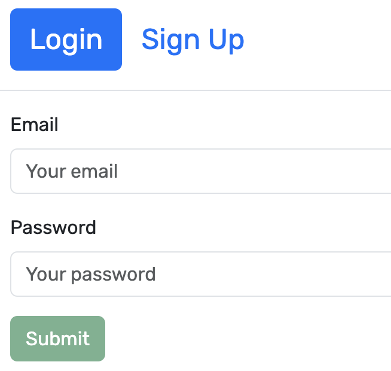
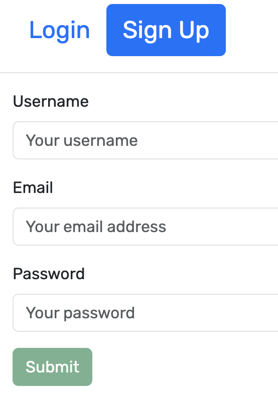
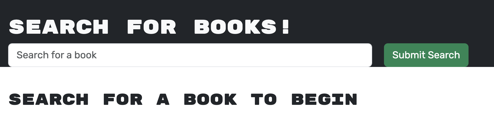

# Book Search

  

  Deployed Application: https://googlebooksearch123-1c087d05aafb.herokuapp.com/

  ## Description
  This application constructed using the MERN structure allows a user to either create and account or log in to their already existing account, and store books they have read or want to read in the profile. They also have the ability to remove books from their saved books in case they no longer want them in there. This is the perfect application for a book lover!
  
  ## Table of Contents
  1. [Installation](#installation)
  2. [Usage Information](#usage)
  3. [License](#license)
  4. [Contributing](#contributing)
  5. [Tests](#tests)
  6. [Questions](#questions)

  ## Installation
  Once cloning the github repository, run "npm i" in the command line to install all of the application's dependencies. 

  ## Usage
  Once you have opened the application, feel free to click around and discover all it has to offer. The Login/Signup button are in the top right hand corner, alongside the Book Search and Saved Books buttons. These will take you to the repsective pages. 

  The Login page: 
  

  The Signup page:
  

  The Search bar: 
  

  Example of books showing in the Search page:
  

  ## License
  This project has a MIT License license. For details about its restrictions and rules, please follow the link below:  
    [MIT License](https://opensource.org/licenses/MIT)  
    

  ## Contributing
  N/A

  ## Tests
  N/A

  ## Questions
  If you have any questions, please find the repository for this application in GitHub from the username: mjonas14.  
  Alternatively, you can click this link: [mjonas14's GitHub](https://github.com/mjonas14).

  If you have any additional questions, you can reach me by sending an email to marcus.jonas14@gmail.com. Thank you and look forward to hearing from you! 
